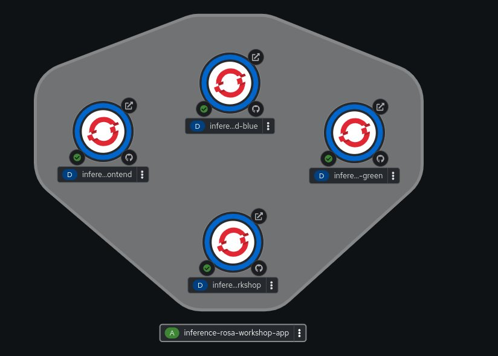

# inference-rosa-frontend
# This adds a Gradio Frontend to the project prior project
Upload in your images to see the predictions made by the model in a web interface.
Mod by Andrew Grimes and Jim Garrett of Red Hat 
Verified Working 01/26/25
No Longer Maintained 

This is a Gradio web front end to an API accessed backend to upload "test images" to a container based 2 tier web-app. You can build out multiple front ends for generational access and create pipeline and webhook driven CI/CD process to simulate onboing development and deployment of projects. You can form the project to your own github page to do additonal development. we recommend you have a github project available for the web front end addition. 

Sample Frontend Input Image: 

    
  <em> 
  </em>

Thisworkshop adds onto a prior deployment for this backend. This workshop ads a Gradio based front end to the project. this expects an existing ROSA cluster and an existing backend deployment in a project. 
Backend Repo https://github.com/emcon33/inference-rosa-workshop

OpenShift/ROSA Web Front End instructions (deck to be created) 
1. Fork this repo to your github account, you will have to modify the URL in this file to your backend and hard code the link prior to the build.
Fork this repo: https://github.com/emcon33/inference-rosa-frontend
Ensure it is public

2. Update the URL from your backend and then Deploy via Git source to your link. 
In your fork github repo, edit the main.py update the below link for your backend URL and commit. Then deploy into your project via git import. 
REST_API_URL = "https://inference-rosa-workshop-test2.apps.rosa-wz89j.pbio.p1.openshiftapps.com/api/predict"

3. Use the two embeded images to test the connection. You can also upload test images from the repo page. 

2 Tier Web App 

    
  <em> 
  </em>

Optional 

4. To Test with a pipeline, rebiuld the project again with a -dev name you can select the "pipeline" option during the github import for the container. This will create a Tekton pipeline.
   
Optional 

5. You can configure a "webhook" to your github that will trigger an auto pull, build and deploy from your github repo fork. The full procedures are here. A "commit" will push the new code and automatically build. 
https://redhat-scholars.github.io/openshift-starter-guides/rhs-openshift-starter-guides/4.9/nationalparks-java-codechanges-github.html

Pipeline that can be manual or webhook driven. 

    
  <em> 
  </em>

This displays a github 2 tier web app with a ResNET18 backend for Image Classificaiton and a Gradio based web frontend. You can test out CI/CD automation with the pipeline and automatic builds. 
Blue Green deployments are also possible with 2 generations of front end connected to a backend. 

Original source https://towardsai.net/p/machine-learning/build-and-deploy-custom-docker-images-for-object-recognition

Forked from this github https://github.com/hasibzunair/imagercg-waiter

Enjoy
