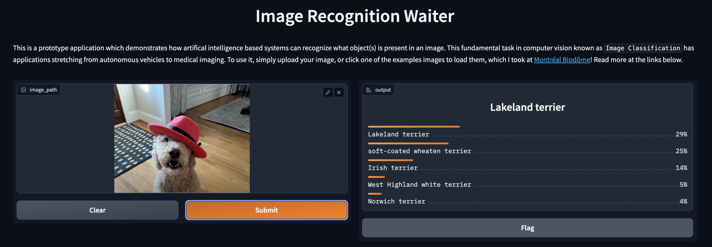

# inference-rosa-workshop
# This is a workshop for deploying a Pytorch & FastAPI project to ROSA on AWS and perform inference.
# This adds a Gradio Frontend to the project prior project
Upload in your images to see the predictions made by the model in a web interface.
Mod by Andrew Grimes and Jim Garrett of Red Hat 

Forked from this project for a workshop: https://github.com/hasibzunair/imagercg-waiter
ResNet18 https://www.mathworks.com/help/deeplearning/ref/resnet18.html

Containerized app that serves a containerized Resnet18 deep learning image classification model using FastAPI. We used an ImageNet pretrained model that can predict 1000 different classes of general objects, the samples are animals but it will work with anything. See class list [here](https://deeplearning.cms.waikato.ac.nz/user-guide/class-maps/IMAGENET/).

Sample Frontend Input Image: 

    
  <em> 
  </em>

OpenShift/ROSA Web Front End instructions (deck to be created) 
1. Deploy this git repository to your ROSA project in the same app as your backend from this git repo and allow it to create a default route. 
Backend Repo https://github.com/emcon33/inference-rosa-workshop

2. The URL for the backend is required to be "added" into this image main.py prior to building to work for your account or use case so the front end points to your backend container. Use your github account and fork the project to your account. Make sure your repo is public. 
gh repo clone emcon33/inference-rosa-frontend

5. Collect the URL of your backend web page and update Main.py with your URL and commit to your version of this repo.
In main.py update the below link for your backend URL and commit. 
REST_API_URL = "https://inference-rosa-workshop-test2.apps.rosa-wz89j.pbio.p1.openshiftapps.com/api/predict"

6. On ROSA build the front end project from your github repo. 

7. Click on the web page open and upload your images. You can create multiple front ends to the same backend via manual git import builds, you can set a pipeline with webhooks, or you can configure ArgoCD to trigger updates etc. 

2 Tier Web App 

    
  <em> 
  </em>

8. To Test a pipeline with a Webhook, you can select the "pipeline" option during the github import for the container. This will create a Tekton pipeline. 

9. You can configure a "webhook" to github that will trigger an auto pull, build and deploy from your github repo fork. The full procedures are here. 
https://redhat-scholars.github.io/openshift-starter-guides/rhs-openshift-starter-guides/4.9/nationalparks-java-codechanges-github.html

Pipeline that can be manual or webhook driven. 

    
  <em> 
  </em>

If you configure a Github Webhook, updates to the Github Repo it will auto build the pipeline fully integrated within the ROSA Plaform. 

Original source https://towardsai.net/p/machine-learning/build-and-deploy-custom-docker-images-for-object-recognition
Forked from this github https://github.com/hasibzunair/imagercg-waiter

`
